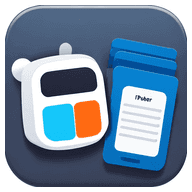

# My To Do

is a Simple To Do App, with support cross platform Web (PWA), Android, & IOS (Coming Soon)

### Add PWA platform

Already available, no need any configuration

---

### Generate PWA Icon

    npx pwa-assets-generator --preset minimal static/icon.png

---

### Add Android platform

    npx cap add android

---

### Generate Android Icon & Splash

Make sure you have add custom icon inside `resources` dir

    npx capacitor-assets generate --android

---

### Live/Hot Reload

in capacitor.config.js, you should add server,

    ...
    server: {
        androidScheme: 'https'
        url: 'YOUR_IP:5173',
        cleartext: true
    },
    ...

then run

    yarn dev --host=0.0.0.0

---

### Build

    yarn build && npx cap sync

Disable url & cleartext on capacitor config server when build
